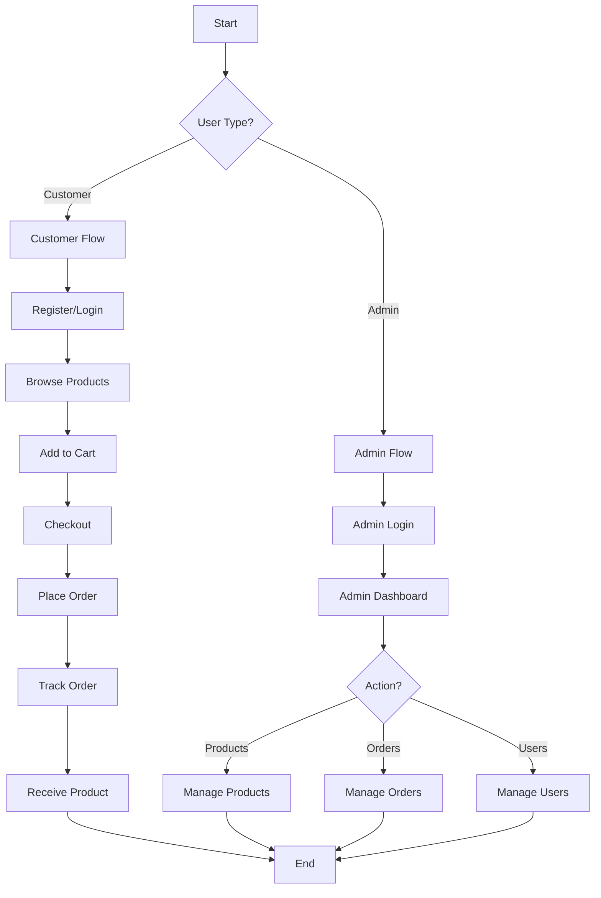

# 🎣 MANCING STRIKE - TOKO ALAT PANCING ONLINE

<div align="center">


**Platform E-Commerce Modern untuk Peralatan Mancing**

[](https://dotnet.microsoft.com/)
[](https://reactjs.org/)
[](https://www.mongodb.com/)
[](https://tailwindcss.com/)

</div>

---

## 👤 PROFIL MAHASISWA

| **Informasi** | **Detail** |
|---------------|------------|
| **Nama** | [Nama Anda] |
| **NIM** | [NIM Anda] |
| **Kelas** | [Kelas Anda] |
| **Mata Kuliah** | Pemrograman Web / Full Stack Development |
| **Semester** | Ganjil 2024/2025 |
| **Dosen** | [Nama Dosen] |
| **Institusi** | [Nama Universitas/Institusi] |

---

## 📋 DAFTAR ISI

1. [Cara Setting Web Service dan Configuration Web](#1-cara-setting-web-service-dan-configuration-web)
2. [Nama Project & Alasan Pemilihan](#2-nama-project--alasan-pemilihan)
3. [Business Process (Proses Bisnis)](#3-business-process-proses-bisnis)
4. [Model Data (Data Modeling)](#4-model-data-data-modeling)
5. [Schema Team (Struktur Tim)](#5-schema-team-struktur-tim)
6. [Mockup Project](#6-mockup-project)
7. [Kesimpulan](#-kesimpulan)

---

## 1. CARA SETTING WEB SERVICE DAN CONFIGURATION WEB

### 📹 Video Tutorial Setup & Konfigurasi

> **📺 Link Video Tutorial:** [YouTube - Mancing Strike Setup Guide](#)
>
> Video tutorial mencakup:
> - ✅ Setup Backend (.NET 9 Web API)
> - ✅ Setup Frontend (React + Vite)
> - ✅ Konfigurasi MongoDB Database
> - ✅ Setup JWT Authentication
> - ✅ Testing API dengan Postman
> - ✅ Running Full Application

### 🔧 A. PREREQUISITES

Sebelum memulai, pastikan sudah terinstall:

```bash
# Required Software
- .NET 9 SDK
- Node.js (v18 atau lebih baru)
- MongoDB Community Server
- Visual Studio Code / Visual Studio 2022
- Git
- Postman (untuk testing API)
```

### 🚀 B. SETUP BACKEND (.NET 9 WEB API)

#### **1. Clone Repository**

```bash
git clone https://github.com/yourusername/mancing-strike.git
cd mancing-strike/backend/MancingStrike.API
```

#### **2. Konfigurasi appsettings.json**

```json
{
  "MongoDBSettings": {
    "ConnectionString": "mongodb://localhost:27017",
    "DatabaseName": "mancing_strike_db"
  },
  "JwtSettings": {
    "Secret": "MancingStrike2024SuperSecretKeyMinimum32Characters!",
    "Issuer": "MancingStrikeAPI",
    "Audience": "MancingStrikeClient",
    "ExpiryInMinutes": 1440
  },
  "Logging": {
    "LogLevel": {
      "Default": "Information",
      "Microsoft.AspNetCore": "Warning"
    }
  },
  "AllowedHosts": "*"
}
```

#### **3. Install Dependencies**

```bash
dotnet restore
```

#### **4. Run Backend Server**

```bash
dotnet run
```

Backend akan berjalan di: `https://localhost:5281` atau `http://localhost:5280`

### 🎨 C. SETUP FRONTEND (REACT + VITE)

#### **1. Navigate ke Frontend Directory**

```bash
cd ../../frontend
```

#### **2. Install Dependencies**

```bash
npm install
```

#### **3. Konfigurasi API Base URL**

Edit file `src/services/api.js`:

```javascript
import axios from 'axios';

const api = axios.create({
  baseURL: 'http://localhost:5280/api', // Sesuaikan dengan port backend
  headers: {
    'Content-Type': 'application/json',
  },
});

export default api;
```

#### **4. Run Frontend Development Server**

```bash
npm run dev
```

Frontend akan berjalan di: `http://localhost:5173`

### 🗄️ D. SETUP MONGODB DATABASE

#### **1. Start MongoDB Service**

**Windows:**
```bash
net start MongoDB
```

**Linux/Mac:**
```bash
sudo systemctl start mongod
```

#### **2. Verify MongoDB Connection**

```bash
mongosh
use mancing_strike_db
show collections
```

#### **3. Create Initial Admin User (Optional)**

Gunakan MongoDB Compass atau mongosh:

```javascript
db.users.insertOne({
  username: "admin",
  email: "admin@mancingstrike.com",
  password: "$2a$11$hashedpassword", // Password akan di-hash oleh aplikasi
  role: "admin",
  createdAt: new Date()
})
```

### ✅ E. VERIFICATION

#### **Test Backend API:**

```bash
# Health Check
curl http://localhost:5280/api/health

# Get Products
curl http://localhost:5280/api/products
```

#### **Test Frontend:**

1. Buka browser: `http://localhost:5173`
2. Register akun baru
3. Login dengan akun yang dibuat
4. Browse products dan test fitur cart

### 🔐 F. ENVIRONMENT VARIABLES

Untuk production, gunakan environment variables:

**Backend (.NET):**
```bash
export MONGODB_CONNECTION="your-mongodb-connection-string"
export JWT_SECRET="your-secret-key"
```

**Frontend (React):**
```bash
VITE_API_URL=https://your-api-url.com/api
```

---

## 2. NAMA PROJECT & ALASAN PEMILIHAN

### 🎣 Nama Project: **Mancing Strike**

**Arti dan Filosofi:**
- **Mancing**: Representasi dari hobi memancing yang populer di Indonesia
- **Strike**: Menggambarkan momen ketika ikan menggigit umpan (strike moment)
- Kombinasi nama yang mudah diingat dan mencerminkan target market

### 🎯 Alasan Menggunakan Project Ini

#### **A. Relevansi dengan Kebutuhan Pasar**

**1. Potensi Pasar Besar**
- Indonesia memiliki garis pantai terpanjang ke-2 di dunia (54,716 km)
- Komunitas pemancing di Indonesia sangat besar dan aktif
- Tren memancing sebagai hobi terus meningkat pasca pandemi

**2. Gap di Pasar Digital**
- Masih sedikit platform e-commerce khusus alat pancing yang user-friendly
- Kebanyakan penjual masih menggunakan marketplace umum
- Kebutuhan akan platform spesialis dengan informasi produk yang detail

**3. Peluang Bisnis**
- Market size industri peralatan mancing di Indonesia mencapai triliunan rupiah
- Pertumbuhan e-commerce di Indonesia 20-30% per tahun
- Niche market dengan customer loyalty tinggi

#### **B. Pembelajaran Komprehensif**

**1. Full-Stack Development**
- **Backend**: ASP.NET Core 9 Web API dengan clean architecture
- **Frontend**: React 19 dengan modern hooks dan state management
- **Database**: MongoDB NoSQL untuk flexible data modeling
- **Authentication**: JWT-based authentication & authorization

**2. Real-World Features**
- User authentication & role-based access control (Admin/Customer)
- Product catalog dengan kategori dan search functionality
- Shopping cart dengan session management
- Order processing dan status tracking
- Admin dashboard untuk management

**3. Modern Development Practices**
- RESTful API design principles
- Component-based architecture (React)
- Responsive design dengan Tailwind CSS
- Async/await patterns untuk API calls
- Error handling dan validation

#### **C. Kompleksitas yang Sesuai**

**1. Tidak Terlalu Sederhana**
- Multiple user roles dengan different permissions
- Complex business logic (cart, checkout, order management)
- Data relationships (users, products, orders)

**2. Tidak Terlalu Kompleks**
- Scope yang jelas dan terdefinisi
- Teknologi yang well-documented
- Timeline development yang realistis (8 minggu)

**3. Scalable Architecture**
- Mudah untuk menambah fitur baru
- Modular code structure
- Separation of concerns

#### **D. Teknologi Modern**

**1. Backend Stack**
- **.NET 9**: Latest LTS version dengan performance improvements
- **MongoDB**: Flexible schema, horizontal scaling capability
- **JWT**: Industry-standard untuk authentication
- **BCrypt**: Secure password hashing

**2. Frontend Stack**
- **React 19**: Latest version dengan improved performance
- **Vite**: Lightning-fast build tool
- **Tailwind CSS**: Utility-first CSS framework
- **Axios**: Promise-based HTTP client
- **React Router**: Client-side routing

### 🛠️ Tech Stack

| **Layer** | **Technology** | **Purpose** |
|-----------|---------------|-------------|
| **Backend** | .NET 9 Web API | RESTful API Server |
| **Frontend** | React 19 + Vite | User Interface |
| **Database** | MongoDB | Data Storage |
| **Authentication** | JWT | Secure Auth |
| **Styling** | Tailwind CSS | Responsive UI |
| **HTTP Client** | Axios | API Communication |
| **Password** | BCrypt | Secure Hashing |

---

## 3. BUSINESS PROCESS (PROSES BISNIS)

### 🔄 A. CUSTOMER BUSINESS PROCESS

#### **1. Registration & Authentication Process**

**Flow Diagram:**
```
START → Landing Page → Register Form → Validation →
Create Account → Email Verification (Optional) →
Login → JWT Token → Access Dashboard → END
```

**Detailed Steps:**

**a. Registration Process**
```
1. Customer mengakses halaman Register
2. Mengisi form registrasi:
   - Username (unique)
   - Email (valid format)
   - Password (min 6 characters)
   - Confirm Password
3. System validasi input:
   - Check username availability
   - Validate email format
   - Check password strength
   - Match password confirmation
4. Password di-hash menggunakan BCrypt
5. Data disimpan ke MongoDB collection 'users'
6. Role otomatis set sebagai 'customer'
7. Redirect ke Login page
```

**b. Login Process**
```
1. Customer input credentials (email/username + password)
2. System validasi:
   - Check user existence
   - Verify password dengan BCrypt
3. Generate JWT token dengan claims:
   - UserId
   - Username
   - Email
   - Role
   - Expiry time (24 hours)
4. Token disimpan di localStorage
5. Redirect ke Dashboard/Home
```

**c. Authentication Middleware**
```
- Setiap request ke protected routes:
  1. Extract JWT token dari header
  2. Validate token signature
  3. Check token expiry
  4. Verify user role
  5. Allow/Deny access
```

#### **2. Shopping & Cart Process**

**Flow Diagram:**
```
Dashboard → Browse Products → Filter/Search →
View Product Detail → Add to Cart → Update Quantity →
View Cart → Proceed to Checkout
```

**Detailed Steps:**

**a. Browse Products**
```
1. Customer mengakses halaman Products
2. System fetch products dari MongoDB
3. Display products dengan informasi:
   - Product image
   - Name & description
   - Price
   - Stock availability
   - Category
4. Filter options:
   - By category (joran, reel, umpan, senar)
   - By price range
   - Search by name
5. Pagination untuk large dataset
```

**b. Product Detail**
```
1. Click product card
2. Navigate ke detail page
3. Display comprehensive info:
   - Full description
   - Specifications
   - Price
   - Stock status
   - Related products
4. Add to Cart button
5. Quantity selector
```

**c. Cart Management**
```
1. Add to Cart:
   - Check stock availability
   - Add item to cart (localStorage/session)
   - Update cart count badge
   - Show success notification

2. View Cart:
   - Display all cart items
   - Show product details
   - Quantity controls (+/-)
   - Remove item option
   - Calculate subtotal per item
   - Calculate total price

3. Update Cart:
   - Increase/decrease quantity
   - Real-time price update
   - Stock validation
   - Remove item confirmation

4. Cart Persistence:
   - Save to localStorage
   - Sync with backend (optional)
   - Restore on page reload
```

#### **3. Checkout & Order Process**

**Flow Diagram:**
```
Cart → Checkout Page → Fill Shipping Info →
Select Payment Method → Review Order →
Confirm Order → Payment → Order Created →
Order Confirmation → Track Order
```

**Detailed Steps:**

**a. Checkout Initiation**
```
1. Customer click "Checkout" dari Cart
2. System validasi:
   - User logged in
   - Cart not empty
   - Stock availability
3. Navigate ke Checkout page
```

**b. Shipping Information**
```
1. Form input:
   - Full Name
   - Phone Number
   - Complete Address
   - City/Province
   - Postal Code
   - Delivery Notes (optional)
2. Validation:
   - Required fields check
   - Phone format validation
   - Address completeness
```

**c. Payment Method Selection**
```
1. Display payment options:
   - Bank Transfer
   - E-Wallet (GoPay, OVO, Dana)
   - COD (Cash on Delivery)
2. Customer select preferred method
3. Show payment instructions
```

**d. Order Review & Confirmation**
```
1. Display order summary:
   - Items list dengan quantity & price
   - Subtotal
   - Shipping cost
   - Total amount
2. Review shipping address
3. Review payment method
4. Terms & conditions checkbox
5. "Place Order" button
```

**e. Order Creation**
```
1. System create order:
   - Generate unique OrderId
   - Save order details to MongoDB
   - Initial status: "Pending"
   - Timestamp: createdAt
2. Reduce product stock
3. Clear shopping cart
4. Generate order confirmation
5. Send confirmation email (optional)
6. Redirect to Success page
```

#### **4. Order Tracking Process**

**Flow Diagram:**
```
My Orders → Order List → Select Order →
View Order Detail → Track Status →
Receive Product → Complete Order
```

**Detailed Steps:**

**a. View Orders List**
```
1. Customer navigate ke "My Orders"
2. System fetch orders by userId
3. Display orders dengan info:
   - Order ID
   - Order Date
   - Total Amount
   - Status badge
   - Quick actions
4. Sort options:
   - Latest first
   - By status
   - By date range
```

**b. Order Detail**
```
1. Click order untuk detail
2. Display comprehensive info:
   - Order ID & Date
   - Status timeline
   - Items ordered
   - Shipping address
   - Payment method
   - Total amount
   - Tracking information
```

**c. Order Status Tracking**
```
Status Flow:
1. Pending → Order placed, waiting confirmation
2. Processing → Admin confirmed, preparing items
3. Shipped → Package sent, in delivery
4. Delivered → Package received by customer
5. Completed → Transaction finished

Visual Timeline:
- Progress bar
- Status icons
- Timestamp per status
- Estimated delivery date
```

---

### 🔄 B. ADMIN BUSINESS PROCESS

#### **1. Login Process**

**Flow Diagram:**
```
START → Admin Login Page → Validate Credentials →
Check Role → Generate Token → Admin Dashboard → END
```

**Detailed Steps:**
```
1. Admin access login page
2. Input credentials:
   - Email/Username
   - Password
3. System validation:
   - Verify credentials
   - Check role = "admin"
   - Generate JWT with admin claims
4. Redirect to Admin Dashboard
5. Access to admin-only routes
```

#### **2. Book Management Process (CRUD)**

> **Note:** Dalam konteks Mancing Strike, "Book" diganti dengan "Product" (Alat Pancing)

##### **CREATE Product**

**Flow Diagram:**
```
Admin Dashboard → Product Management → Add New Product →
Fill Form → Upload Image → Validate → Save → Success
```

**Detailed Steps:**
```
1. Navigate ke "Product Management"
2. Click "Add New Product" button
3. Fill product form:
   - Product Name
   - Description
   - Category (joran/reel/umpan/senar)
   - Price
   - Stock Quantity
   - Image Upload
   - Specifications (optional)
4. Form validation:
   - Required fields check
   - Price format validation
   - Stock must be positive number
   - Image size/format check
5. Submit form
6. System process:
   - Upload image to server/cloud
   - Generate product ID
   - Save to MongoDB 'products' collection
   - Set createdAt timestamp
7. Show success message
8. Redirect to product list
```

##### **READ/VIEW Products**

**Flow Diagram:**
```
Admin Dashboard → Product Management → View All Products →
Filter/Search → View Details → Actions (Edit/Delete)
```

**Detailed Steps:**
```
1. Display products table:
   - Product ID
   - Image thumbnail
   - Name
   - Category
   - Price
   - Stock
   - Status (Active/Inactive)
   - Actions (Edit/Delete)
2. Features:
   - Search by name
   - Filter by category
   - Sort by price/stock/date
   - Pagination
3. Click product untuk detail view
4. Quick actions:
   - Edit button
   - Delete button
   - Toggle active status
```

##### **UPDATE Product**

**Flow Diagram:**
```
Product List → Select Product → Edit Button →
Update Form → Modify Data → Validate → Save → Success
```

**Detailed Steps:**
```
1. Click "Edit" pada product
2. Load existing data ke form
3. Modify fields yang ingin diubah
4. Upload new image (optional)
5. Validation sama seperti CREATE
6. Submit update
7. System process:
   - Update document di MongoDB
   - Update image jika ada perubahan
   - Set updatedAt timestamp
8. Show success message
9. Refresh product list
```

##### **DELETE Product**

**Flow Diagram:**
```
Product List → Select Product → Delete Button →
Confirmation Dialog → Confirm → Delete → Success
```

**Detailed Steps:**
```
1. Click "Delete" pada product
2. Show confirmation dialog:
   - "Are you sure want to delete this product?"
   - Product name display
   - Warning message
3. If confirmed:
   - Delete from MongoDB
   - Delete associated image
   - Remove from active listings
4. If cancelled:
   - Close dialog
   - No action taken
5. Show success/cancel message
6. Refresh product list
```

#### **3. Order Management Process**

**Flow Diagram:**
```
Admin Dashboard → Order Management → View All Orders →
Filter by Status → View Order Detail → Update Status →
Process Order → Complete
```

**Detailed Steps:**

**a. View All Orders**
```
1. Navigate ke "Order Management"
2. Display orders table:
   - Order ID
   - Customer Name
   - Order Date
   - Total Amount
   - Status
   - Actions
3. Filter options:
   - By status (Pending/Processing/Shipped/Delivered)
   - By date range
   - By customer
   - Search by Order ID
4. Sort options:
   - Latest first
   - By amount
   - By status
5. Pagination untuk large dataset
```

**b. Order Detail & Processing**
```
1. Click order untuk detail
2. Display full information:
   - Customer details
   - Shipping address
   - Items ordered
   - Payment info
   - Current status
3. Admin actions:
   - Update order status
   - Add tracking number
   - Add notes
   - Print invoice
   - Contact customer
4. Status update workflow:
   - Pending → Processing: Confirm order
   - Processing → Shipped: Add tracking, mark shipped
   - Shipped → Delivered: Confirm delivery
   - Any → Cancelled: Cancel with reason
```

**c. Order Status Management**
```
Status Update Process:
1. Select new status from dropdown
2. Add notes/reason (required for cancel)
3. Add tracking number (required for shipped)
4. Confirm status change
5. System updates:
   - Update order status
   - Add timestamp
   - Send notification to customer (optional)
   - Update inventory if cancelled
6. Log status change history
```

#### **4. User Management Process**

**Flow Diagram:**
```
Admin Dashboard → User Management → View All Users →
Filter/Search → View User Detail → Edit Role →
Activate/Deactivate → Save
```

**Detailed Steps:**

**a. View All Users**
```
1. Navigate ke "User Management"
2. Display users table:
   - User ID
   - Username
   - Email
   - Role (Admin/Customer)
   - Status (Active/Inactive)
   - Registration Date
   - Actions
3. Features:
   - Search by username/email
   - Filter by role
   - Filter by status
   - Sort by date
```

**b. User Management Actions**
```
1. View User Detail:
   - Personal information
   - Order history
   - Account status
   - Activity log

2. Edit User Role:
   - Change role (Customer ↔ Admin)
   - Confirmation required
   - Update permissions

3. Activate/Deactivate User:
   - Toggle user status
   - Deactivated users cannot login
   - Can be reactivated anytime

4. Delete User (Optional):
   - Permanent deletion
   - Confirmation required
   - Cannot be undone
```

---

### 📊 C. FLOW DIAGRAM LENGKAP

#### **Complete System Flow**



---

## 4. MODEL DATA (DATA MODELING)

### 🗄️ Database: MongoDB (NoSQL Document-Oriented)

**Alasan Menggunakan MongoDB:**
- Flexible schema untuk product variations
- Horizontal scaling capability
- Fast read/write operations
- JSON-like documents (BSON)
- Rich query language
- Good for e-commerce applications

### 📦 A. COLLECTION: `users`

**Purpose:** Menyimpan data user (customer dan admin)

**Schema Structure:**

```javascript
{
  "_id": ObjectId("..."),
  "username": String,
  "email": String,
  "password": String, // BCrypt hashed
  "role": String, // "admin" atau "customer"
  "createdAt": Date,
  "updatedAt": Date
}
```

**Sample Document:**

```json
{
  "_id": "674a1b2c3d4e5f6g7h8i9j0k",
  "username": "johndoe",
  "email": "john@example.com",
  "password": "$2a$11$KqH8Z9X...", // Hashed password
  "role": "customer",
  "createdAt": "2024-11-10T10:30:00Z",
  "updatedAt": "2024-11-10T10:30:00Z"
}
```

**Field Explanation:**

| Field | Type | Description | Constraints |
|-------|------|-------------|-------------|
| `_id` | ObjectId | Unique identifier | Auto-generated |
| `username` | String | Username untuk login | Unique, required |
| `email` | String | Email address | Unique, required, valid format |
| `password` | String | Hashed password | Required, min 6 chars |
| `role` | String | User role | "admin" or "customer" |
| `createdAt` | Date | Account creation date | Auto-generated |
| `updatedAt` | Date | Last update date | Auto-updated |

**Business Rules:**
- Username dan email harus unique
- Password harus di-hash dengan BCrypt (salt rounds: 11)
- Default role adalah "customer"
- Email harus valid format
- Username tidak boleh mengandung spasi

---

### 📦 B. COLLECTION: `products`

**Purpose:** Menyimpan data produk alat pancing

**Schema Structure:**

```javascript
{
  "_id": ObjectId("..."),
  "name": String,
  "description": String,
  "category": String,
  "price": Number,
  "stock": Number,
  "imageUrl": String,
  "createdAt": Date,
  "updatedAt": Date
}
```

**Sample Document:**

```json
{
  "_id": "674b2c3d4e5f6g7h8i9j0k1l",
  "name": "Joran Shimano FX 210",
  "description": "Joran berkualitas tinggi untuk mancing laut, panjang 2.1 meter, material carbon fiber",
  "category": "joran",
  "price": 450000,
  "stock": 25,
  "imageUrl": "/uploads/joran-shimano-fx-210.jpg",
  "createdAt": "2024-11-10T11:00:00Z",
  "updatedAt": "2024-11-10T11:00:00Z"
}
```

**Field Explanation:**

| Field | Type | Description | Constraints |
|-------|------|-------------|-------------|
| `_id` | ObjectId | Unique identifier | Auto-generated |
| `name` | String | Product name | Required, max 200 chars |
| `description` | String | Product description | Required |
| `category` | String | Product category | Required, enum values |
| `price` | Number | Product price (IDR) | Required, positive number |
| `stock` | Number | Available stock | Required, non-negative |
| `imageUrl` | String | Product image path | Required |
| `createdAt` | Date | Product creation date | Auto-generated |
| `updatedAt` | Date | Last update date | Auto-updated |

**Category Values:**
- `joran` - Joran/Rod
- `reel` - Reel
- `umpan` - Umpan/Bait
- `senar` - Senar/Line

**Business Rules:**
- Price harus positive number
- Stock tidak boleh negative
- Category harus salah satu dari enum values
- Image harus di-upload sebelum save
- Stock akan berkurang saat order dibuat

---

### 📦 C. COLLECTION: `orders`

**Purpose:** Menyimpan data pesanan customer

**Schema Structure:**

```javascript
{
  "_id": ObjectId("..."),
  "userId": String,
  "customerName": String,
  "customerEmail": String,
  "items": [
    {
      "productId": String,
      "productName": String,
      "quantity": Number,
      "price": Number
    }
  ],
  "totalAmount": Number,
  "shippingAddress": String,
  "status": String,
  "createdAt": Date,
  "updatedAt": Date
}
```

**Sample Document:**

```json
{
  "_id": "674c3d4e5f6g7h8i9j0k1l2m",
  "userId": "674a1b2c3d4e5f6g7h8i9j0k",
  "customerName": "John Doe",
  "customerEmail": "john@example.com",
  "items": [
    {
      "productId": "674b2c3d4e5f6g7h8i9j0k1l",
      "productName": "Joran Shimano FX 210",
      "quantity": 2,
      "price": 450000
    },
    {
      "productId": "674b2c3d4e5f6g7h8i9j0k1m",
      "productName": "Reel Daiwa BG 3000",
      "quantity": 1,
      "price": 850000
    }
  ],
  "totalAmount": 1750000,
  "shippingAddress": "Jl. Merdeka No. 123, Jakarta Pusat, DKI Jakarta 10110",
  "status": "pending",
  "createdAt": "2024-11-10T14:30:00Z",
  "updatedAt": "2024-11-10T14:30:00Z"
}
```

**Field Explanation:**

| Field | Type | Description | Constraints |
|-------|------|-------------|-------------|
| `_id` | ObjectId | Unique order identifier | Auto-generated |
| `userId` | String | Reference to user | Required, FK to users |
| `customerName` | String | Customer full name | Required |
| `customerEmail` | String | Customer email | Required |
| `items` | Array | Ordered products | Required, min 1 item |
| `items.productId` | String | Reference to product | Required |
| `items.productName` | String | Product name snapshot | Required |
| `items.quantity` | Number | Quantity ordered | Required, positive |
| `items.price` | Number | Price snapshot | Required |
| `totalAmount` | Number | Total order amount | Calculated |
| `shippingAddress` | String | Delivery address | Required |
| `status` | String | Order status | Required, enum values |
| `createdAt` | Date | Order creation date | Auto-generated |
| `updatedAt` | Date | Last update date | Auto-updated |

**Status Flow:**
```
pending → processing → shipped → delivered → completed
                    ↓
                cancelled
```

**Status Values:**
- `pending` - Order placed, waiting confirmation
- `processing` - Order confirmed, being prepared
- `shipped` - Order shipped, in delivery
- `delivered` - Order delivered to customer
- `completed` - Transaction completed
- `cancelled` - Order cancelled

**Business Rules:**
- Order harus memiliki minimal 1 item
- TotalAmount = sum of (quantity × price) untuk semua items
- Status harus mengikuti flow yang valid
- Product name dan price di-snapshot untuk historical record
- Stock product berkurang saat order dibuat
- Stock dikembalikan jika order di-cancel

---

### 🔗 D. RELATIONSHIP DIAGRAM

```
┌─────────────┐
│   USERS     │
│─────────────│
│ _id (PK)    │
│ username    │
│ email       │
│ password    │
│ role        │
└──────┬──────┘
       │
       │ 1:N (One user has many orders)
       │
       ↓
┌─────────────┐
│   ORDERS    │
│─────────────│
│ _id (PK)    │
│ userId (FK) │◄────┐
│ items[]     │     │
│ totalAmount │     │
│ status      │     │
└──────┬──────┘     │
       │            │
       │ N:M        │ Reference
       │ (Many to   │ (Embedded)
       │  Many)     │
       ↓            │
┌─────────────┐     │
│  PRODUCTS   │     │
│─────────────│     │
│ _id (PK)    │─────┘
│ name        │
│ category    │
│ price       │
│ stock       │
└─────────────┘
```

**Relationship Explanation:**

1. **Users → Orders (One-to-Many)**
   - Satu user bisa memiliki banyak orders
   - Relationship via `userId` field di orders collection

2. **Orders → Products (Many-to-Many)**
   - Satu order bisa berisi banyak products
   - Satu product bisa ada di banyak orders
   - Implemented via embedded array `items[]` di orders
   - Product data di-snapshot untuk historical accuracy

**Data Denormalization Strategy:**
- Product name dan price disimpan di order items (snapshot)
- Alasan: Preserve historical data jika product berubah
- Trade-off: Slight data redundancy untuk better query performance

---

### 📊 E. SAMPLE DATA EXAMPLE

**Sample User (Customer):**
```json
{
  "_id": "user001",
  "username": "pemancing_pro",
  "email": "pemancing@email.com",
  "password": "$2a$11$hashed...",
  "role": "customer",
  "createdAt": "2024-11-01T08:00:00Z"
}
```

**Sample Product:**
```json
{
  "_id": "prod001",
  "name": "Joran Maguro Avenger 180",
  "description": "Joran casting untuk mancing di laut, sangat kuat dan tahan lama",
  "category": "joran",
  "price": 350000,
  "stock": 15,
  "imageUrl": "/uploads/joran-maguro.jpg",
  "createdAt": "2024-11-05T10:00:00Z"
}
```

**Sample Order:**
```json
{
  "_id": "order001",
  "userId": "user001",
  "customerName": "Pemancing Pro",
  "customerEmail": "pemancing@email.com",
  "items": [
    {
      "productId": "prod001",
      "productName": "Joran Maguro Avenger 180",
      "quantity": 1,
      "price": 350000
    }
  ],
  "totalAmount": 350000,
  "shippingAddress": "Jl. Pantai Indah No. 45, Surabaya",
  "status": "processing",
  "createdAt": "2024-11-10T15:00:00Z"
}
```

---

## 5. SCHEMA TEAM (STRUKTUR TIM)

### 👥 A. STRUKTUR ORGANISASI TIM

**Total Anggota Tim: 1 Orang (Solo Project)**

Karena ini adalah project individual untuk tugas kuliah, semua role dikerjakan oleh satu orang dengan pembagian waktu yang terstruktur.

**Pembagian Role & Waktu:**

| **Role** | **Tanggung Jawab** | **Alokasi Waktu** |
|----------|-------------------|-------------------|
| **Project Manager** | Planning, timeline, documentation | 10% |
| **Backend Developer** | API development, database design | 35% |
| **Frontend Developer** | UI/UX implementation, React components | 35% |
| **Database Administrator** | MongoDB setup, data modeling | 10% |
| **QA/Tester** | Testing, bug fixing | 10% |

### 📋 B. DETAIL ROLE & TANGGUNG JAWAB

#### **1. Project Manager / Team Leader**

**Responsibilities:**
- ✅ Project planning dan timeline management
- ✅ Requirement analysis
- ✅ Documentation (README, API docs)
- ✅ Progress tracking
- ✅ Risk management

**Deliverables:**
- Project proposal
- Timeline & milestones
- Weekly progress reports
- Final documentation

**Tools:**
- Notion / Trello untuk task management
- GitHub Projects untuk issue tracking
- Google Docs untuk documentation

#### **2. Backend Developer**

**Responsibilities:**
- ✅ Design dan implement RESTful API
- ✅ Authentication & authorization (JWT)
- ✅ Business logic implementation
- ✅ Database integration
- ✅ API testing dengan Postman
- ✅ Error handling & validation

**Deliverables:**
- ASP.NET Core 9 Web API
- Controllers (Auth, Products, Orders, Admin)
- Models & DTOs
- Services layer
- MongoDB integration
- JWT authentication
- API documentation

**Tech Stack:**
- .NET 9 SDK
- MongoDB.Driver
- BCrypt.Net
- JWT Bearer Authentication
- Swagger/OpenAPI

**Key Features Implemented:**
- User registration & login
- Product CRUD operations
- Order management
- Admin functionalities
- Role-based authorization

#### **3. Frontend Developer**

**Responsibilities:**
- ✅ Design dan implement user interface
- ✅ React components development
- ✅ State management
- ✅ API integration dengan Axios
- ✅ Responsive design
- ✅ User experience optimization
- ✅ Form validation

**Deliverables:**
- React application dengan Vite
- Pages (Home, Products, Cart, Checkout, Orders)
- Admin dashboard
- Reusable components
- Context API untuk state management
- Responsive layouts dengan Tailwind CSS

**Tech Stack:**
- React 19
- Vite
- React Router DOM
- Axios
- Tailwind CSS
- Context API

**Key Features Implemented:**
- User authentication UI
- Product catalog dengan filter
- Shopping cart functionality
- Checkout process
- Order tracking
- Admin panel

#### **4. Database Administrator**

**Responsibilities:**
- ✅ Database design & modeling
- ✅ MongoDB setup & configuration
- ✅ Collection schema design
- ✅ Indexing strategy
- ✅ Data migration
- ✅ Backup strategy
- ✅ Performance optimization

**Deliverables:**
- MongoDB database setup
- Collections: users, products, orders
- Indexes untuk performance
- Sample data seeding
- Database documentation

**Tools:**
- MongoDB Community Server
- MongoDB Compass
- Mongosh (MongoDB Shell)

**Database Design:**
- 3 main collections
- Proper indexing
- Data relationships
- Validation rules

#### **5. QA/Tester**

**Responsibilities:**
- ✅ Test planning
- ✅ Manual testing
- ✅ API testing
- ✅ UI/UX testing
- ✅ Bug reporting & tracking
- ✅ Regression testing
- ✅ User acceptance testing

**Deliverables:**
- Test cases document
- Bug reports
- Test results
- Quality assurance report

**Testing Scope:**
- Authentication flow
- Product management
- Cart functionality
- Checkout process
- Order management
- Admin features
- Responsive design
- Cross-browser compatibility

**Tools:**
- Postman (API testing)
- Browser DevTools
- Manual testing checklist

---

### 📅 C. TIMELINE & MILESTONE

**Total Duration: 8 Minggu (2 Bulan)**

| **Week** | **Sprint** | **Focus** | **Deliverables** |
|----------|-----------|-----------|------------------|
| **1** | Sprint 1 | Setup & Planning | Project setup, database design, API structure |
| **2** | Sprint 1 | Backend Core | Authentication, user management |
| **3** | Sprint 2 | Backend Features | Product CRUD, order management |
| **4** | Sprint 2 | Frontend Core | React setup, authentication UI, routing |
| **5** | Sprint 3 | Frontend Features | Product pages, cart, checkout |
| **6** | Sprint 3 | Admin Panel | Admin dashboard, management features |
| **7** | Sprint 4 | Integration & Testing | Full integration, bug fixing |
| **8** | Sprint 4 | Polish & Deploy | Final testing, documentation, deployment |

**Milestone Breakdown:**

**Sprint 1 (Week 1-2): Foundation**
- ✅ Project initialization
- ✅ MongoDB setup
- ✅ Backend API structure
- ✅ Authentication system
- ✅ User registration & login

**Sprint 2 (Week 3-4): Core Features**
- ✅ Product management API
- ✅ Order management API
- ✅ Frontend setup
- ✅ Basic UI components
- ✅ Authentication UI

**Sprint 3 (Week 5-6): Advanced Features**
- ✅ Shopping cart
- ✅ Checkout process
- ✅ Order tracking
- ✅ Admin dashboard
- ✅ Product management UI

**Sprint 4 (Week 7-8): Finalization**
- ✅ Full integration testing
- ✅ Bug fixes
- ✅ UI/UX improvements
- ✅ Documentation
- ✅ Deployment preparation

---

### 🔄 D. WORKFLOW & COLLABORATION

**Development Workflow:**

```
1. Planning
   ↓
2. Design (Database + UI)
   ↓
3. Backend Development
   ↓
4. Frontend Development
   ↓
5. Integration
   ↓
6. Testing
   ↓
7. Bug Fixing
   ↓
8. Documentation
   ↓
9. Deployment
```

**Daily Routine:**
- Morning: Planning & prioritization
- Midday: Development (Backend/Frontend)
- Afternoon: Testing & bug fixing
- Evening: Documentation & commit

**Version Control:**
- Git untuk version control
- GitHub untuk repository
- Commit messages yang descriptive
- Branch strategy: main, develop, feature branches

---

### 🛠️ E. TOOLS & TECHNOLOGIES

**Development Tools:**
- **IDE**: Visual Studio Code / Visual Studio 2022
- **API Testing**: Postman
- **Database**: MongoDB Compass
- **Version Control**: Git + GitHub
- **Design**: Figma (untuk mockup)

**Collaboration Tools:**
- **Documentation**: Notion / Google Docs
- **Task Management**: Trello / GitHub Projects
- **Communication**: Discord / WhatsApp (untuk konsultasi dosen)

---

### 🎯 F. SUCCESS METRICS

**Project Success Criteria:**
- ✅ All core features implemented
- ✅ Authentication working properly
- ✅ CRUD operations functional
- ✅ Responsive design
- ✅ No critical bugs
- ✅ Complete documentation
- ✅ Deployed and accessible

**Learning Outcomes:**
- ✅ Full-stack development skills
- ✅ RESTful API design
- ✅ React development
- ✅ MongoDB database management
- ✅ Authentication & authorization
- ✅ Project management
- ✅ Problem-solving skills

---

## 6. MOCKUP PROJECT

### 🎨 Desain Interface Aplikasi

> **Note:** Mockup dibuat menggunakan Figma/Balsamiq untuk visualisasi UI/UX sebelum development.

### 📱 A. PUBLIC PAGES

#### **1. Landing Page (Home)**

**Purpose:** Halaman utama yang menyambut pengunjung

**Elements:**
- Hero section dengan tagline "Peralatan Mancing Terlengkap"
- Featured products carousel
- Category cards (Joran, Reel, Umpan, Senar)
- Call-to-action buttons (Shop Now, Register)
- Footer dengan informasi kontak

**Layout:**
```
┌─────────────────────────────────────┐
│         NAVBAR (Logo, Menu)         │
├─────────────────────────────────────┤
│                                     │
│         HERO SECTION                │
│    "Peralatan Mancing Terlengkap"  │
│         [Shop Now Button]           │
│                                     │
├─────────────────────────────────────┤
│      FEATURED PRODUCTS              │
│  [Product 1] [Product 2] [Product 3]│
├─────────────────────────────────────┤
│         CATEGORIES                  │
│  [Joran] [Reel] [Umpan] [Senar]   │
├─────────────────────────────────────┤
│           FOOTER                    │
└─────────────────────────────────────┘
```

#### **2. Login Page**

**Purpose:** Halaman untuk user login

**Elements:**
- Login form (Email/Username, Password)
- "Remember Me" checkbox
- "Forgot Password?" link
- Login button
- "Don't have account? Register" link

**Form Fields:**
- Email/Username (required)
- Password (required, type="password")
- Submit button
- Link to Register page

#### **3. Register Page**

**Purpose:** Halaman untuk registrasi user baru

**Elements:**
- Registration form
- Username field
- Email field
- Password field
- Confirm Password field
- Register button
- "Already have account? Login" link

**Validation:**
- Username: unique, no spaces
- Email: valid format
- Password: min 6 characters
- Confirm Password: must match

---

### 👨‍💼 B. ADMIN PAGES

#### **1. Admin Dashboard**

**Purpose:** Overview admin panel

**Elements:**
- Statistics cards:
  - Total Products
  - Total Orders
  - Total Users
  - Revenue
- Recent orders table
- Quick actions menu
- Charts (optional)

**Layout:**
```
┌─────────────────────────────────────┐
│  SIDEBAR  │    MAIN CONTENT         │
│           │                         │
│ Dashboard │  ┌───┐ ┌───┐ ┌───┐    │
│ Products  │  │ 50│ │120│ │ 45│    │
│ Orders    │  │Prd│ │Ord│ │Usr│    │
│ Users     │  └───┘ └───┘ └───┘    │
│ Logout    │                         │
│           │  Recent Orders          │
│           │  ┌─────────────────┐   │
│           │  │ Order List      │   │
│           │  └─────────────────┘   │
└─────────────────────────────────────┘
```

#### **2. Product Management (Admin)**

**Purpose:** Manage all products

**Elements:**
- Products table dengan columns:
  - Image
  - Name
  - Category
  - Price
  - Stock
  - Actions (Edit/Delete)
- "Add New Product" button
- Search bar
- Filter by category
- Pagination

#### **3. Add New Product (Admin)**

**Purpose:** Form untuk menambah produk baru

**Form Fields:**
- Product Name (text, required)
- Description (textarea, required)
- Category (select, required)
- Price (number, required)
- Stock (number, required)
- Image Upload (file, required)
- Submit button
- Cancel button

#### **4. Edit Product (Admin)**

**Purpose:** Form untuk edit produk existing

**Elements:**
- Same form as Add Product
- Pre-filled dengan data existing
- Update button
- Cancel button
- Delete button

#### **5. Order Management (Admin)**

**Purpose:** Manage customer orders

**Elements:**
- Orders table dengan columns:
  - Order ID
  - Customer Name
  - Date
  - Total Amount
  - Status
  - Actions (View Detail, Update Status)
- Filter by status
- Search by Order ID
- Date range filter
- Pagination

**Status Badge Colors:**
- Pending: Yellow
- Processing: Blue
- Shipped: Purple
- Delivered: Green
- Cancelled: Red

#### **6. Order Detail (Admin)**

**Purpose:** View detailed order information

**Elements:**
- Order information:
  - Order ID
  - Order Date
  - Customer Name & Email
  - Shipping Address
- Items table:
  - Product Name
  - Quantity
  - Price
  - Subtotal
- Total Amount
- Current Status
- Status update dropdown
- Update Status button
- Back button

---

### 👤 C. CUSTOMER PAGES

#### **1. Products Page (Customer)**

**Purpose:** Browse all available products

**Elements:**
- Product grid/list
- Each product card shows:
  - Product image
  - Name
  - Price
  - Stock status
  - "Add to Cart" button
- Sidebar filters:
  - Category filter
  - Price range filter
- Search bar
- Sort options (Price, Name, Newest)
- Pagination

**Layout:**
```
┌─────────────────────────────────────┐
│         NAVBAR                      │
├──────────┬──────────────────────────┤
│ FILTERS  │    PRODUCT GRID          │
│          │                          │
│Category  │  [Prod1] [Prod2] [Prod3]│
│□ Joran   │  [Prod4] [Prod5] [Prod6]│
│□ Reel    │  [Prod7] [Prod8] [Prod9]│
│□ Umpan   │                          │
│□ Senar   │  [Pagination]            │
│          │                          │
│Price     │                          │
│[Range]   │                          │
└──────────┴──────────────────────────┘
```

#### **2. Product Detail (Customer)**

**Purpose:** View detailed product information

**Elements:**
- Large product image
- Product name
- Price
- Description
- Category
- Stock availability
- Quantity selector
- "Add to Cart" button
- "Buy Now" button
- Related products section

#### **3. Shopping Cart (Customer)**

**Purpose:** View and manage cart items

**Elements:**
- Cart items table:
  - Product image
  - Name
  - Price
  - Quantity controls (+/-)
  - Subtotal
  - Remove button
- Cart summary:
  - Subtotal
  - Shipping (if applicable)
  - Total
- "Continue Shopping" button
- "Proceed to Checkout" button
- Empty cart message (if cart is empty)

**Layout:**
```
┌─────────────────────────────────────┐
│         SHOPPING CART               │
├─────────────────────────────────────┤
│ [Img] Product Name                  │
│       Price: Rp 100,000             │
│       Qty: [-] 2 [+]  [Remove]      │
│       Subtotal: Rp 200,000          │
├─────────────────────────────────────┤
│ [Img] Product Name                  │
│       Price: Rp 150,000             │
│       Qty: [-] 1 [+]  [Remove]      │
│       Subtotal: Rp 150,000          │
├─────────────────────────────────────┤
│                    CART SUMMARY     │
│                    Subtotal: 350k   │
│                    Shipping: Free   │
│                    Total: 350k      │
│                                     │
│  [Continue Shopping] [Checkout]     │
└─────────────────────────────────────┘
```

#### **4. Checkout (Customer)**

**Purpose:** Complete order purchase

**Elements:**
- Shipping information form:
  - Full Name
  - Phone Number
  - Complete Address
  - City/Province
  - Postal Code
- Payment method selection:
  - Bank Transfer
  - E-Wallet
  - COD
- Order summary:
  - Items list
  - Total amount
- Terms & conditions checkbox
- "Place Order" button

#### **5. Order Success (Customer)**

**Purpose:** Confirmation after successful order

**Elements:**
- Success icon/animation
- "Order Placed Successfully!" message
- Order ID
- Order summary
- Estimated delivery date
- "View Order Detail" button
- "Continue Shopping" button

#### **6. My Orders (Customer)**

**Purpose:** View order history

**Elements:**
- Orders list dengan cards:
  - Order ID
  - Order Date
  - Total Amount
  - Status badge
  - "View Detail" button
- Filter by status
- Search by Order ID
- Sort by date
- Empty state (if no orders)

**Layout:**
```
┌─────────────────────────────────────┐
│         MY ORDERS                   │
├─────────────────────────────────────┤
│ Order #12345          [Processing]  │
│ Date: 2024-11-10                    │
│ Total: Rp 350,000                   │
│ [View Detail]                       │
├─────────────────────────────────────┤
│ Order #12344          [Delivered]   │
│ Date: 2024-11-08                    │
│ Total: Rp 500,000                   │
│ [View Detail]                       │
└─────────────────────────────────────┘
```

#### **7. Order Detail (Customer)**

**Purpose:** View detailed order information

**Elements:**
- Order information:
  - Order ID
  - Order Date
  - Status timeline
- Items ordered:
  - Product name
  - Quantity
  - Price
- Shipping address
- Payment method
- Total amount
- "Track Order" button (if shipped)
- "Cancel Order" button (if pending)

**Status Timeline:**
```
● Pending ────● Processing ────○ Shipped ────○ Delivered
  Nov 10         Nov 11           Nov 12        Nov 13
```

---

### 📊 D. SUMMARY MOCKUP

Total **15+ mockup screens** mencakup:

| **Category** | **Jumlah** | **Screens** |
|--------------|-----------|-------------|
| **Public** | 3 screens | Home, Login, Register |
| **Admin** | 6 screens | Dashboard, Product List/Add/Edit, Order List/Detail |
| **Customer** | 7 screens | Products, Product Detail, Cart, Checkout, Success, My Orders, Order Detail |

---

### 🎯 E. MOCKUP FEATURES HIGHLIGHT

**✅ User Flow yang Jelas:**
```
Landing → Register → Login → Browse Products →
Add to Cart → Checkout → Order Success → Track Order
```

**✅ Admin Flow yang Lengkap:**
```
Login → Dashboard → Manage Products/Orders →
Update Status → View Reports
```

**✅ Design Principles:**
- Responsive design (mobile-first approach)
- Consistent layout dan navigation
- Clear call-to-action buttons
- User-friendly interface
- Intuitive navigation flow
- Color-coded status (visual feedback)
- Loading states & error handling
- Empty states untuk better UX

---

### 🛠️ F. TOOLS USED FOR MOCKUP

- **Figma** - High-fidelity design & prototyping
- **Balsamiq** (optional) - Low-fidelity wireframing
- **Tailwind CSS** - Actual implementation styling
- **React Icons** - Icon library

---

## 📌 KESIMPULAN

### Summary Project:

**1. Web Service & Configuration:**
- Complete setup guide untuk backend dan frontend
- MongoDB database configuration
- JWT authentication implementation
- Environment variables management
- Development dan production setup

**2. Nama Project:**
- **Mancing Strike** dipilih karena:
  - Relevansi dengan pasar Indonesia (negara maritim)
  - Niche market dengan potensi besar
  - Pembelajaran full-stack development yang komprehensif
  - Kompleksitas yang sesuai untuk project kuliah
  - Menggunakan teknologi modern (.NET 9, React 19, MongoDB)

**3. Business Process:**
- **Customer Flow**: Register → Browse → Cart → Checkout → Track Order
- **Admin Flow**: Login → Manage Products/Orders/Users → Update Status
- Complete lifecycle management dari order creation hingga delivery
- Clear separation of concerns antara customer dan admin

**4. Model Data:**
- MongoDB NoSQL dengan 3 collections utama:
  - **users**: Authentication & user data
  - **products**: Product catalog
  - **orders**: Transaction records
- Relationship: One-to-Many (users-orders), Many-to-Many (products-orders)
- Denormalization strategy untuk performance optimization
- Proper indexing dan validation rules

**5. Schema Team:**
- Solo project dengan multiple roles
- Structured timeline: 8 minggu dengan 4 sprint
- Clear role separation: PM, Backend, Frontend, DBA, QA
- Agile methodology dengan iterative development
- Complete documentation dan testing

**6. Mockup Project:**
- **15+ mockup screens** lengkap untuk semua user journey
- Figma/Balsamiq untuk design
- User flow yang clear dan intuitive
- Responsive design consideration
- Consistent UI/UX patterns

---

### 🎯 Project Goals Achieved:

✅ **Comprehensive E-Commerce Platform** untuk toko alat pancing online
✅ **Multi-Role System** (Admin & Customer) dengan clear separation
✅ **Complete Transaction Flow** dari browsing hingga delivery
✅ **Modern Tech Stack** dengan .NET 9, React 19, dan MongoDB
✅ **Scalable Architecture** dengan clean code dan best practices
✅ **User-Friendly Interface** dengan responsive Tailwind CSS design
✅ **Secure Authentication** dengan JWT dan BCrypt password hashing
✅ **RESTful API** dengan proper HTTP methods dan status codes

---

### 📚 Pembelajaran yang Didapat:

1. **Backend Development**: CRUD operations, business logic, authentication, API design
2. **Frontend Development**: React components, state management, routing, API integration
3. **Database Design**: NoSQL modeling, relationships, optimization, indexing
4. **Full-Stack Integration**: Backend-Frontend connectivity, CORS, API consumption
5. **Authentication & Security**: JWT tokens, password hashing, role-based access
6. **Project Management**: Timeline planning, task distribution, documentation
7. **Problem Solving**: Debugging, error handling, testing, deployment

---

## 📄 LISENSI

Project ini dibuat untuk keperluan **Tugas Kuliah Pemrograman Visual** - Semester Ganjil 2025/2026

**© 2025 [Faiz Maulana] - [312310469] - [TI.23.A.5]**

---

<div align="center">

**📧 Contact:** [faiz.maulana1405@gmail.com]
**🔗 Repository:** [GitHub - Mancing Strike](https://github.com/yourusername/mancing-strike)
**🌐 Live Demo:** [Demo Link](#) *(jika sudah deploy)*

---

**⭐ Jika dokumentasi ini membantu, jangan lupa berikan star! ⭐**

*Last Updated: November 2025*

</div>
